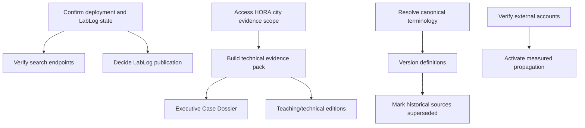

# Prioritized Next Actions

Baseline: 27 July 2026.

Effort is a relative estimate for planning, not a schedule commitment. No dates
beyond the existing 30-day propagation agenda are introduced.

## Critical — blocks propagation

| ID | Action | Reason | Evidence | Owner type | Effort | Dependency | Completion criterion |
|---|---|---|---|---|---|---|---|
| ACT-C-001 | Identify the production deployment commit and reconcile `/lablog` | Live route and current branch have opposite publication states | `FND-002`; public verification evidence | Hosting admin + repository owner | Small | Hosting access and human publication decision | Deployment SHA recorded; route, sitemap and navigation agree in repository and production |
| ACT-C-002 | Obtain a bounded HORA.city evidence workspace | The institutional site has no application code or runtime evidence | `FND-003`; Case File 001 assessment | HORA technical owner | Medium | Repository/runtime access and privacy boundary | Repository/branch/SHA, flow scope and approved sanitization rules documented |
| ACT-C-003 | Produce the minimum Case File 001 technical evidence pack | The case cannot support technical or restoration claims | `FND-003`, `FND-004` | Investigator + HORA technical owner | Large | ACT-C-002 | Reproduction, OPP, checkpoints, sanitized snapshots, finding status and evidence index exist |
| ACT-C-004 | Verify live robots, sitemap, redirects and search ownership | Configured crawlability is not externally verified and may differ from deployment | `PJL-SEO-001`, `PJL-SEO-002`; external checklist | Search/hosting owner | Small | ACT-C-001 | Dated HTTP captures plus Google/Bing ownership and sitemap state stored |
| ACT-C-005 | Verify or replace the Udemy coupon URL | A time-sensitive commercial CTA appears on every canonical page | `PJL-COURSE-001`; `content/site.ts:17-19` | Udemy instructor + site owner | Small | Udemy dashboard access | Approved canonical URL, coupon validity/expiry and owner recorded; all rendered CTAs match |

## High — needed during the first 10 days

| ID | Action | Reason | Evidence | Owner type | Effort | Dependency | Completion criterion |
|---|---|---|---|---|---|---|---|
| ACT-H-001 | Decide the canonical taxonomy of Trace Engineering | Two current canonical datasets conflict | `SEM-002` | Method owner/editor | Medium | Human methodology decision | One approved definition/status and explicit relationship to Software System Investigation and Trace Engineer |
| ACT-H-002 | Approve the public mapping for Founding Reference Case 001 and `RPJ-HORA-001` | Baseline mandate and current public ID need stable coexistence | `SEM-005` | LAB owner/editor | Small | Human naming decision | Mapping is documented in canonical case metadata without replacing HORA.city |
| ACT-H-003 | Introduce an editorial status/version model | Methods, glossary and case are undated/unversioned | Metadata audit; `SEM-008` | Method owner + editor | Medium | Version policy | Every canonical definition/case page has approved status, version and update date |
| ACT-H-004 | Mark historical documents as superseded where appropriate | Old terms remain searchable in the repository | `SEM-001`, `SEM-003`, `SEM-004` | Documentation owner | Medium | ACT-H-001 and version policy | Each superseded collection/file has a visible banner and current canonical link |
| ACT-H-005 | Define evidence levels for case claims | Internal documentary consistency is being called confirmed evidence | `SEM-006`; Case File 001 | Investigator + editor | Medium | ACT-C-003 design | Published glossary distinguishes documentary, runtime, implementation, external and verified outcome evidence |
| ACT-H-006 | Verify YouTube and approve LinkedIn/GitHub/contact identities | Current propagation channels are incomplete or unverified | `PJL-CHANNEL-001..003` | Valéria/channel admins | Small-medium | Account access | Approved URLs, ownership and public/private status recorded; no null destination is promoted |
| ACT-H-007 | Verify analytics, consent and legal requirements | GA is embedded, while property/consent/legal state is unknown | `PJL-SEO-005`; technical audit | Analytics + legal/privacy + technical owner | Medium | Account and jurisdictional review | Ownership, data collection, retention, consent and required policy path are documented |
| ACT-H-008 | Create an active/incomplete Executive Case Dossier | A bounded dossier can propagate the case without implying closure | Case edition readiness | Investigator/editor | Medium | ACT-H-002 and evidence-level policy | Dated dossier states confirmed facts, hypotheses, gaps and active status, with evidence references |

## Medium — needed during the 30-day cycle

| ID | Action | Reason | Evidence | Owner type | Effort | Dependency | Completion criterion |
|---|---|---|---|---|---|---|---|
| ACT-M-001 | Create route-specific Open Graph images | One square logo is reused for all pages | Metadata audit; `PJL-BRAND-001` | Design/content owner | Medium | Approved brand assets | Priority routes have accessible, correctly sized and verified social previews |
| ACT-M-002 | Add verified structured entities only where evidence exists | Course/case/article entities are absent | Structured-data audit | SEO + content owner | Medium | External entity verification | Schema validates and matches visible content; no unsupported claim is introduced |
| ACT-M-003 | Publish the first LabLog entry only if LabLog is approved public | Empty live route has no dated content | `PJL-LABLOG-001` | Investigator/editor | Medium | ACT-C-001; editorial contract; evidence source | One dated, sourced, authorized entry exists and is linked to its case/evidence |
| ACT-M-004 | Create a current documentation index | Hundreds of screenshots and overlapping reports obscure current authority | `PJL-DOC-002..007` | Documentation owner | Medium | Superseded decisions | Index labels current, historical, draft and deprecated collections |
| ACT-M-005 | Publish a sanitized OPP template and HORA.city instance | The method output is defined but absent | `PJL-METHOD-004`; case gaps | Method owner + investigator | Medium | ACT-C-003 | Template and case instance distinguish probable and confirmed path segments |
| ACT-M-006 | Establish external publication identities | No ORCID/Zenodo/article inventory is repository-verifiable | External checklist | Valéria/research owner | Medium | Identity and publication decisions | Approved profiles and any DOI/publication records are documented and cross-linked |
| ACT-M-007 | Instrument outbound CTA events | Repository shows tags but no Udemy/YouTube event model | Link/analytics audit | Analytics/technical owner | Small-medium | ACT-H-007 | Named events fire once per intended action and are visible in analytics |
| ACT-M-008 | Capture the cycle-end comparison with the same manifest/inventory schema | The baseline is intended for propagation comparison | This baseline manifest/inventory | Audit owner | Medium | Completion of cycle | Stable IDs reused; added, changed and removed assets reported without rewriting history |

## Low — later optimization

| ID | Action | Reason | Evidence | Owner type | Effort | Dependency | Completion criterion |
|---|---|---|---|---|---|---|---|
| ACT-L-001 | Add IndexNow if it fits the search strategy | No implementation exists | Technical audit | SEO/technical owner | Small | Bing/search strategy | Submission is authenticated, monitored and documented |
| ACT-L-002 | Evaluate alternate languages | Site declares only `pt-BR` | Metadata audit | Content/localization owner | Large | Translation and canonical policy | Real translated routes and reciprocal alternates exist |
| ACT-L-003 | Create route breadcrumbs and schema | Current navigation is shallow but lacks explicit breadcrumb schema | Structured-data audit | UX/SEO owner | Medium | Stable information architecture | Visible breadcrumbs and matching valid schema are deployed |
| ACT-L-004 | Evaluate newsletter/Instagram/Medium/DEV only with owners | These channels are absent/unverified | External checklist | Valéria/channel owner | Variable | Channel strategy | Each approved channel has purpose, owner, URL and measurement plan |

## Dependency flow

