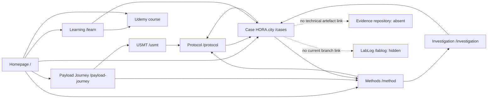

# Route and Link Map

Baseline: 27 July 2026.

## Route table

| Route | Source | Purpose | Discoverability | Principal incoming links | Principal outgoing links | Canonical/indexing state | Notes |
|---|---|---|---|---|---|---|---|
| `/` | `app/page.tsx` | Institutional entry | Primary | Logo, redirects to host root | Payload Journey, Learn, Method, Cases, Ecosystem, Lab | Canonical; sitemap | Live content differs from branch |
| `/payload-journey` | `app/payload-journey/page.tsx` | Canonical Payload Journey method | Header CTA, footer, homepage | Home, Learn, Method, Investigation, USMT | USMT, Method, Learn | Canonical; sitemap | Publicly retrieved |
| `/learn` | `app/learn/page.tsx` | Learning progression and course | Primary nav/footer | Home, Method, Cases, Investigation, Lab, Ecosystem | Payload Journey, Cases, Method, Udemy | Canonical; sitemap | Coupon state external |
| `/cases` | `app/cases/page.tsx` | Case registry/HORA.city | Primary nav/footer | Almost every route via nav or continuation | Method, Protocol | Canonical; sitemap | One case; two documentary sources |
| `/usmt` | `app/usmt/page.tsx` | Canonical USMT page | Footer/method/home | Payload Journey, Method, Protocol | Payload Journey, Protocol, Method | Canonical; sitemap | Current expansion is Modeling |
| `/method` | `app/method/page.tsx` | Methods taxonomy | Primary nav/footer | Home and most continuation paths | Protocol, Investigation, Payload Journey, USMT, Cases | Canonical; sitemap | Trace Engineering taxonomy conflict |
| `/protocol` | `app/protocol/page.tsx` | Four-phase investigation protocol | Footer/continuations | Method, Investigation, Cases, USMT | Method, Investigation, Cases | Canonical; sitemap | Artefact templates not published |
| `/investigation` | `app/investigation/page.tsx` | Practice and developing role | Footer/continuations | Method, Protocol, Lab | Method, Protocol, Learn, Cases | Canonical; sitemap | Live copy differs from branch |
| `/lab-definitions` | `app/lab-definitions/page.tsx` | Full glossary | Footer and homepage block | Home, Lab footer | Home, Lab, Method | Canonical; sitemap | Public retrieval inconclusive |
| `/lab` | `app/lab/page.tsx` | Mission, founder, pilot and status | Primary nav/footer | Home, Ecosystem, Lab Definitions | Method, Investigation, Cases, Learn | Canonical; sitemap | Person schema present |
| `/ecosystem` | `app/ecosystem/page.tsx` | Four ecosystem pillars | Footer/homepage | Home, Lab | Learn, Cases, Lab | Canonical; sitemap | No collaboration CTA |
| `/lablog` | `app/lablog/page.tsx` | Dated investigation records | Hidden in branch; live deployment links it | Live nav/home/cases; none in branch public nav | Cases, Lab, Protocol | Branch 404/excluded; live page present | Zero entries; publication drift |
| `/about` | `next.config.mjs` | Legacy compatibility | Historical links/direct requests | External legacy links unknown | `/lab#sobre` | Permanent redirect configured | Live redirect unverified |
| `/robots.txt` | `app/robots.ts` | Crawler policy | Standard endpoint | Crawler convention | Sitemap | Build output | Live body unverified |
| `/sitemap.xml` | `app/sitemap.ts` | Route discovery | robots/config | `robots.txt` | 11 canonical URLs | Build output | No `lastModified`; live body unverified |

## Dynamic routes, groups and middleware

- Dynamic routes: none.
- Route groups: none.
- Middleware: none.
- Rewrites: none.
- Custom access headers: none found.

## Primary navigation

The five primary items are:

1. Início → `/`
2. Aprender → `/learn`
3. Métodos → `/method`
4. Casos → `/cases`
5. LAB → `/lab`

The header CTA “Começar” links to `/payload-journey`.

The footer adds direct access to:

- `/protocol`;
- `/investigation`;
- `/usmt`;
- `/ecosystem`;
- `/lab-definitions`;
- Udemy;
- YouTube.

## Orphan assessment

Canonical public pages: **11**  
Canonical orphan pages: **0**

`/lab-definitions` is not in the five-item primary navigation, but it is linked
from the footer and homepage. `/ecosystem`, `/protocol`, `/investigation` and
`/usmt` are similarly reachable from footer/continuations. `/lablog` is
intentionally unavailable in current branch behavior, so it is classified as a
conditional publication conflict rather than an orphan.

## Method-to-case-to-course paths

## Link metrics

- Internal links validated by repository harness: yes.
- Maximum discovery depth among canonical routes: 1.
- Maximum continuation links per route: 4.
- Rendered external destination types: 2 (Udemy, YouTube).
- Canonical pages carrying a Udemy link through global footer: 11.
- Canonical pages with an explicit HORA.city/case progression path: 7.
- Broken internal route destinations detected: 0.
- Placeholder `href="#"` counted as public navigation: 0.

## Public deployment comparison

Selected public pages were retrievable, including `/lablog`. The live site links
to LabLog in places where the current branch removes it. Because no deployment
workflow or commit marker is available, the route graph above describes the
current branch, while the public drift is recorded as a separate finding.

Evidence:

- [`evidence/routes/route-discovery.md`](evidence/routes/route-discovery.md)
- [`evidence/links/link-discovery.md`](evidence/links/link-discovery.md)
- [`evidence/links/public-verification.md`](evidence/links/public-verification.md)
